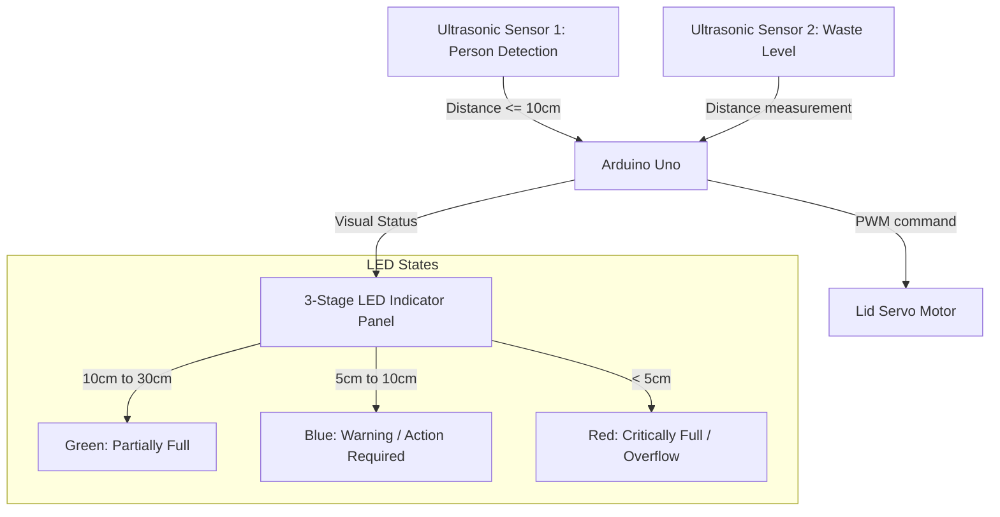

# IntelliBin: Smart Dual-Sensor Waste Management System

IntelliBin is an automated, touchless smart bin designed to improve hygiene and waste management efficiency. Using an Arduino microcontroller and dual ultrasonic sensors, it provides hands-free lid operation and real-time fill-level tracking via multi-color LED indicators.



---

## Features

- **Touchless Proximity Activation**: Detects an approaching user within 10 cm and automatically opens the lid for 5 seconds using a servo motor.
- **3-Stage Fill-Level Tracking**: Monitors the internal waste depth and dynamically updates an LED indicator panel to reflect bin capacity.
- **Energy-Efficient Design**: Utilizes low-power ultrasonic components with low-latency polling for stable, continuous operation.
- **Modular Hardware Layout**: Separates detection logic (person vs. waste) to prevent false-triggering while depositing trash.

---

## Hardware Specifications & Pin Mapping

### 1. Primary Components
- **Microcontroller**: Arduino Uno (or equivalent).
- **Actuator**: Micro Servo Motor (e.g., SG-90) for lid mechanism.
- **Sensors**: 2x HC-SR04 Ultrasonic Sensors.
- **Indicators**: 3x standard LEDs (Green, Blue, Red) with 220-ohm resistors.

### 2. Wiring & Pin Configuration

| Component | Arduino Pin | Input/Output | Description |
| :--- | :---: | :---: | :--- |
| **Person Sensor (Trig)** | **Pin 3** | Output | Triggers sonar pulse for user detection |
| **Person Sensor (Echo)** | **Pin 2** | Input | Receives return pulse for user detection |
| **Waste Sensor (Trig)** | **Pin 5** | Output | Triggers sonar pulse for fill-level check |
| **Waste Sensor (Echo)** | **Pin 4** | Input | Receives return pulse for fill-level check |
| **Lid Servo (Signal)** | **Pin 7** | Output (PWM) | Controls lid angle (0 to 90 degrees) |
| **Green LED** | **Pin 9** | Output | Indicates moderate/normal waste level |
| **Blue LED** | **Pin 10** | Output | Indicates bin is filling up (warning) |
| **Red LED** | **Pin 11** | Output | Indicates bin is full (immediate empty required) |

---

## System Logic & Operation

### 1. Lid Control
The system continuously measures the distance of objects directly in front of the bin. If a user is detected within the threshold:
- Servo sweeps to **90 degrees** (open).
- Holds open for **5 seconds** (5000 ms delay).
- Sweeps back to **0 degrees** (closed).

### 2. Fill-Level Indicators
A second downward-facing ultrasonic sensor inside the lid measures the distance to the trash surface. If the waste level rises past 30 cm, the system updates the LED indicators:
- **Green LED (Pin 9)**: Active when waste distance is between **10 cm and 30 cm** (bin contains waste but has ample space).
- **Blue LED (Pin 10)**: Active when waste distance is between **5 cm and 10 cm** (bin is approaching capacity).
- **Red LED (Pin 11)**: Active when waste distance is **less than 5 cm** (bin is full).

---

## Legacy/Alternative Configuration (IR Sensor Version)

An alternative version of the system (`Dustbin.ino`) exists for lower-cost implementations:
- **Person Detection**: Uses a digital **Infrared (IR) Proximity Sensor** (on **Pin 8**) instead of a sonar sensor.
- **Waste Level**: Uses a single ultrasonic sensor (Trig: **Pin 7**, Echo: **Pin 6**).
- **Lid Actuation**: Servo on **Pin 9** sweeps to 70 degrees when the IR sensor outputs LOW (object detected).
- **LED Pins**: Green LED (Pin 2), Blue LED (Pin 3), Red LED (Pin 4).

---

## Calibration and Troubleshooting

### 1. Servo Limit Adjustment
Depending on the mechanical hinge design, adjust the servo angles in `SmartDustbin.ino`:
```cpp
lidServo.write(90); // Increase or decrease this angle to set the maximum open position
```

### 2. Proximity Sensitivity
To change how close a person must stand to open the lid, modify the `personDetectDistance` variable (in centimeters):
```cpp
const int personDetectDistance = 15; // Set to 15 cm instead of 10 cm
```
